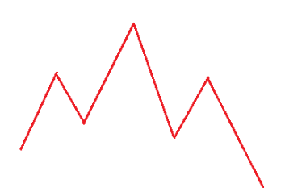

## [122. Best Time to Buy and Sell Stock II](https://leetcode.com/problems/best-time-to-buy-and-sell-stock-ii/description/?envType=study-plan-v2&envId=top-interview-150 "Title")

### 題目
給予每日股票交易的價格，每日只能持有一檔股票，算出最高的獲利是多少：


Example：  
Input：prices = [1, 2, 3, 4, 5]  
Output：4  
Explanation：Buy on day 1 (price = 1) and sell on day 5 (price = 5), profit = 5-1 = 4.
Total profit is 4.

### 解題步驟
1. 看圖可以更好理解，假設股價的走勢如圖：  
  

2. 想要利益最大化，只要賺到每個上升區段的錢即可。
3. 時間複雜度O(n)。


### 程式實作

```javascript
/**
 * @param {number[]} prices
 * @return {number}
 */
var maxProfit = function(prices) {
    let profit = 0;

    for (let i = 1; i < prices.length; i++) {
        if (prices[i] > prices[i - 1]) {
            profit += prices[i] - prices[i - 1];
        }
    }

    return profit;
};
```


