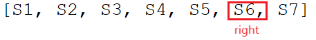

## [134. Gas Station](https://leetcode.com/problems/gas-station/description/?envType=study-plan-v2&envId=top-interview-150 "Title")

### 題目
有n個加油站，gas[i]紀錄第i個加油站可以補給的油量，cost[i]是第i個加油站到第i+1個加油站消耗的油量。

找出起始點，可以順時針環繞這些加油站一圈，如果無法環繞，回傳-1。

### 解題步驟
1. 建立一個陣列，紀錄每個加油站可以補給的油量，減去到下一個加油站的油量，所得的剩餘油量。
2. 如果暴力破解，對每個位置都進行測試，時間複雜度會是O(n^2)。
3. 先找到第一個剩餘油量是正值的位置，作為起始點。
4. 建立一個右指標，指向目前累加到的最後一個加油站，順時針累計剩餘油量，直到出現負值，或是環繞一圈。
5. 如果出現負值，就在右指標的右側尋找新的起始點。
6. 可以直接跳到右指標的右側，是因為到一個新的加油站時，累計油量只可能大於等於0，例如：  
  
假設S1開始累計，其中只有S1跟S4的剩餘油量都是正的，累計到S6的時候出現負值，可以推斷S4並不能成為新的起始點，因為S1+S2+S3 >= 0，代表了S4 + S5 + S6 < 0

7. 時間複雜度是O(n)。


### 程式實作

```javascript
/**
 * @param {number[]} gas
 * @param {number[]} cost
 * @return {number}
 */
var canCompleteCircuit = function(gas, cost) {
    let res = gas.map((_, index) => (gas[index] - cost[index]))
    let pos = 0;

    // 先找到第一個正數，作為起始位置
    while (pos < gas.length && res[pos] < 0) {
        pos++;
    }

    while (pos < gas.length) {
        let cumSum = res[pos];
        let right = (pos + 1) % gas.length;

        while (cumSum >= 0) {
            if (pos === right) {
                return pos;
            }

            cumSum += res[right];
            right = (right + 1) % gas.length;
        }

        if (right <= pos) {
            return -1;
        }

        pos = right;
        while (pos < gas.length && res[pos] < 0) {
            pos++;
        }
    }

    return -1;
};
```


