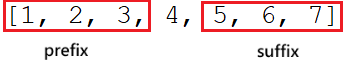

## [238. Product of Array Except Self](https://leetcode.com/problems/product-of-array-except-self/?envType=study-plan-v2&envId=top-interview-150 "Title")


### 題目
給予一個陣列，計算除了自己之外，所有元素相乘的結果，不得使用除法，並在O(n)的時間內完成。

Example 1:  
Input: nums = [1, 2, 3, 4]  
Output: [24, 12, 8, 6]

### 解題步驟
1. 建立兩個陣列，一個元素紀錄該位置之前的所有元素相乘，另一個元素紀錄該位置之後的所有元素相乘：  
  

2. 計算除了該位置，所有元素相乘公式：prefix * suffix


### 程式實作

```javascript
/**
 * @param {number[]} nums
 * @return {number[]}
 */
var productExceptSelf = function(nums) {
    let prefix = Array(nums.length).fill(0);
    let suffix = Array(nums.length).fill(0);
    let product = Array(nums.length).fill(0);

    prefix[0] = 1;
    suffix[nums.length - 1] = 1;

    for (let i = 1; i < nums.length; i++) {
        prefix[i] = prefix[i - 1] * nums[i - 1];
    }

    for (let i = nums.length - 2; i >= 0; i--) {
        suffix[i] = suffix[i + 1] * nums[i + 1];
    }

    for (let i = 0; i < nums.length; i++) {
        product[i] = prefix[i] * suffix[i];
    }

    return product
};
```


