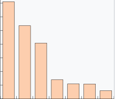

## [274. H-Index](https://leetcode.com/problems/h-index/description/?envType=study-plan-v2&envId=top-interview-150 "Title")

### 題目
給予一個陣列，第i個位置的值，代表該論文被引用的次數，找出所有論文的h-index值是什麼。

h-index代表的是"有h篇文章至少被引用h次"。

### 解題步驟 - 方法一
1. 看圖較好理解，如果將論文由大到小排序，確保前面的論文引用次數，一定大於後面的：     
  
 
2. 在每個位置檢查，是否citations的值，大於目前所在位置的論文數量。
3. 時間最多花在排序上，O(n^2)，效率不是很好，使用方法2進行修正。

### 程式實作

```javascript
/**
 * @param {number[]} citations
 * @return {number}
 */
var hIndex = function (citations) {
    let citationsSort = [...citations];
    citationsSort.sort((a, b) => b - a);

    for (let i = 0; i < citationsSort.length; i++) {
        if (citationsSort[i] < i + 1) {
            return i;
        }
    }

    return citations.length;
};
```

### 解題步驟 - 方法二
1. 建立一個空陣列，用來記錄每個引用次數有多少論文被引用，例如：
citations = [3, 0, 6, 1, 5]  
將引用數量進行整理：[1, 1, 0, 1, 0, 2]，第一個位置代表引用0次的次數，以此類推，最後一個位置代表引用5次以上的次數。
2. 從後面開始檢查，第一個出現，符合文章數 >= 引用次數的，即為h-index。
3. 時間複雜度是O(n)。

### 程式實作
```javascript
var hIndex = function (citations) {
    let citationsCount = Array(citations.length + 1).fill(0);

    for (let i = 0; i < citations.length; i++) {
        let citationsNum = citations[i] > citations.length ? citations.length : citations[i];
        citationsCount[citationsNum] += 1;
    }

    let accum = 0;

    for (let i = citations.length; i >= 0; i--) {
        accum += citationsCount[i];

        if (accum >= i) {
            return i;
        }
    }

    return 0;
};
```