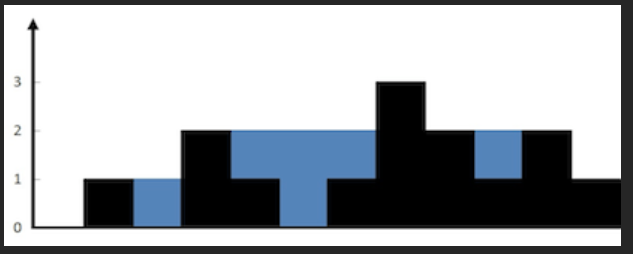
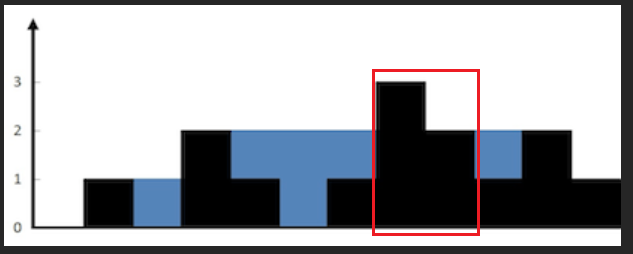
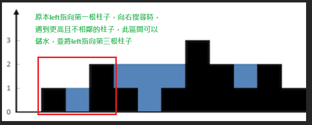
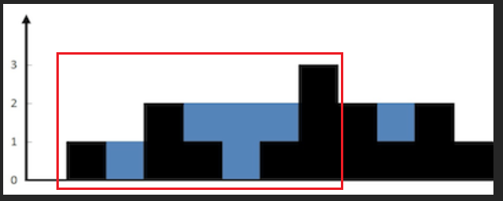

## [42. Trapping Rain Water](https://leetcode.com/problems/trapping-rain-water/description/?envType=study-plan-v2&envId=top-interview-150 "Title")

### 題目
給予一個陣列，紀錄著每個位置的高度，計算下雨的時候，可以容納多少水：  
  

### 解題步驟
1. 兩個柱子之間，必需存在凹槽才能儲水，這樣是無法儲水的：  


2. 建立一個left變數指向目前打算儲水的最左邊的位置，並且從左邊往右邊搜尋，會遇到幾種狀況：
> * 遇到柱子高度比目前left的柱子還低，將其落差記錄下來，繼續往右搜尋
> * 遇到相鄰柱子高度>=目前left指向的高度、無法儲水，left向右移動。
> * 碰到更高或相等的柱子，沒有跟left相鄰，代表此區間可以儲水，並且更新left位置：  
  

3. 從左邊往右邊搜尋完成後，已經計算到的儲水區：  
  

4. 以同樣的方式，從右邊再往左邊走一遍，就可以計算到所有的儲水區。
5. 要注意的是，如果高度是 [2, 0, 2] 這樣的型態，將會重複計算，所以從右邊往左計算的時候，忽略這個狀況。
6. 時間複雜度是O(N)。


### 程式實作

```javascript
/**
 * @param {number[]} height
 * @return {number}
 */

var trap = function(height) {
    let sum = 0;
    let tmepSum = 0;
    let left = 0;
    let right = height.length - 1;

    for (let i = 1; i < height.length; i++) {
        if (height[i] >= height[left]) {
            if (i !== left + 1) {
                sum += tmepSum;
            }

            tmepSum = 0;
            left = i;
        } else {
            tmepSum += height[left] - height[i]; 
        }


    }

    tmepSum = 0;
    
    for (let i = height.length - 2; i >= 0; i--) {
        if (height[i] >= height[right] && height[right] !== height[i]) {
            if (i !== right - 1) {
                sum += tmepSum;    
            }

            tmepSum = 0;
            right = i;
        } else {
            tmepSum += height[right] - height[i]; 
        } 
    }

    return sum;
};
```


