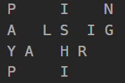
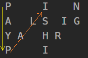
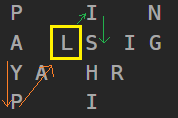

## [6. Zigzag Conversion](https://leetcode.com/problems/zigzag-conversion/description/?envType=study-plan-v2&envId=top-interview-150 "Title")

### 題目
字串"PAYPALISHIRING"是用zigzag的模式閱讀的：  
  
把它改成用由上往下，一列一列的閱讀："PINALSIGYAHRPI"


### 解題步驟 - 方法一
1. 假設轉換的列數 row =  4
2. 觀察字元跳動的規律，以第一列跟最後一列為例，如果想要跳到下一個字元的所在位置：  
  
可以看到扣除最底 / 頂端的列(只經過一次)，中間的列都會經過兩次，所以可以算出跟下一個字元間，夾了(row - 2) * 2 + 1 = 5個字元

3. 如果不是第一列跟最後一列：  
  
一樣檢查經過幾個中間列*2，再加上第一 / 最後一列的字元，就可以算出下一個位置。 


### 程式實作

```javascript
/**
 * @param {string} s
 * @param {number} numRows
 * @return {string}
 */

var convert = function(s, numRows) {
    let strConvert = "";

    if (s.length <= numRows || numRows === 1) {
        return s;
    }

    for (let i = 0; i < numRows; i++) {
        let stepsRound1 = (numRows - i - 2) * 2 + 2;
        let stepsRound2 = (i - 1) * 2 + 2;
        let curPoint = i;

        strConvert += s[i];

        while(curPoint < s.length) {
            if (stepsRound1 > 0) {
                curPoint += stepsRound1;
                strConvert = curPoint < s.length ? strConvert + s[curPoint] : strConvert;
            }

            if (stepsRound2 > 0) {
                curPoint += stepsRound2;
                strConvert = curPoint < s.length ? strConvert + s[curPoint] : strConvert;
            }
        }
    }

    return strConvert;
};

```


### 解題步驟 - 方法二
1. 建立一個二維陣列，總共有numRows列。
2. 模擬zigZag的走法，根據字元在zigZag模式下，會在哪一列，放到對應的二維陣列的列中。
3. 接著以第一列、第二列...的方式，加入到轉換後的字串。


### 程式實作

```javascript
/**
 * @param {string} s
 * @param {number} numRows
 * @return {string}
 */
var convert = function(s, numRows) {
    let strConvert = "";
    let pos = 0;
    let record = Array(numRows).fill();
    record = record.map(() => []);


    while (pos < s.length) {
        for (let row = 0; row < numRows && pos < s.length; row++) {
            record[row].push(s[pos]);
            pos++;
        }

        for (let row = numRows - 2; row >= 1 && pos < s.length; row--) {
            record[row].push(s[pos]);
            pos++
        }
    }
    
    for (let i = 0; i < numRows; i++) {
        strConvert += record[i].join("");
    }

    return strConvert;
};

```