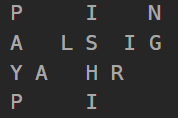
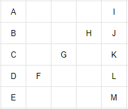
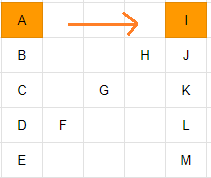
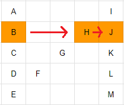

## [6. Zigzag Conversion](https://leetcode.com/problems/zigzag-conversion/description/?envType=study-plan-v2&envId=top-interview-150 "Title")

### 題目
字串"PAYPALISHIRING"是用zigzag的模式閱讀的：  
  
把它改成用由上往下，一列一列的閱讀："PINALSIGYAHRPI"


### 解題步驟 - 方法一
1. 假設有一個5列(row = 5)的字串需要轉換：  
    

2. 觀察字元跳動的規律，可以分成兩種狀況：
    * 字元在第一列和最後一列
    * 字元不在第一列和最後一列
3. 如果字元在第一列和最後一列，以第一列為例，想找出下一個字元的位置：  
    
    * 從A到J的時候，扣除最後一列，每一列都會經過兩次
    * 得出兩個字元間有多少字元的公式：
        > (row - 2) * 2 + 1 
        > 總共插進"(5 - 2) * 2 + 1 = 7"個字元
4. 如果字元不在第一列和最後一列，以第二列為例：  
      

    可以分為：
    * 經過最後一列到達下一個位置，兩個字元間有多少字元的公式：  
        >  (row - i - 2) * 2 + 1
    * 經過第一列到達下一個位置，兩個字元間有多少字元的公式：  
        > (i - 1) * 2 + 1
    * 這裡的row是總共幾列，也就是5，i指的是陣列中的位置，也就是1

5. 將兩者的公式進行合併，第一列公式合併成：  
    >  (row - i - 2) * 2 + 1  

    最後一列公式的則可以合併到：
    > (i - 1) * 2 + 1
    
6. 時間複雜度就是字串的長度


### 程式實作

```javascript
/**
 * @param {string} s
 * @param {number} numRows
 * @return {string}
 */

var convert = function(s, numRows) {
    let strConvert = "";

    if (s.length <= numRows || numRows === 1) {
        return s;
    }

    for (let i = 0; i < numRows; i++) {
        let stepsRound1 = (numRows - i - 2) * 2 + 2;
        let stepsRound2 = (i - 1) * 2 + 2;
        let curPoint = i;

        strConvert += s[i];

        while(curPoint < s.length) {
            if (stepsRound1 > 0) {
                curPoint += stepsRound1;
                strConvert = curPoint < s.length ? strConvert + s[curPoint] : strConvert;
            }

            if (stepsRound2 > 0) {
                curPoint += stepsRound2;
                strConvert = curPoint < s.length ? strConvert + s[curPoint] : strConvert;
            }
        }
    }

    return strConvert;
};

```


### 解題步驟 - 方法二
1. 建立一個二維陣列，總共有row列。
2. 跟著zigZag的路線走一遍字串，根據字元在zigZag模式下，會在哪一列，放到對應的二維陣列的列中。
3. 接著以第一列、第二列...的方式，加入到轉換後的字串。


### 程式實作

```javascript
/**
 * @param {string} s
 * @param {number} numRows
 * @return {string}
 */
var convert = function(s, numRows) {
    let strConvert = "";
    let pos = 0;
    let record = Array(numRows).fill();
    record = record.map(() => []);


    while (pos < s.length) {
        for (let row = 0; row < numRows && pos < s.length; row++) {
            record[row].push(s[pos]);
            pos++;
        }

        for (let row = numRows - 2; row >= 1 && pos < s.length; row--) {
            record[row].push(s[pos]);
            pos++
        }
    }
    
    for (let i = 0; i < numRows; i++) {
        strConvert += record[i].join("");
    }

    return strConvert;
};

```