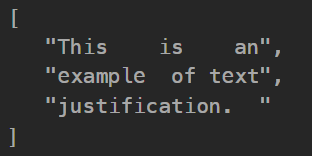

## [68. Text Justification](https://leetcode.com/problems/text-justification/description/?envType=study-plan-v2&envId=top-interview-150 "Title")

### 題目
給予一串文字，以及一個寬度maxWidth，讓文字的每一列都不超過這個maxWidth，並且有以下限制：
1. 每列要盡量放滿更多的單字(greedy)。
2. 單字之間的空格應盡可能均勻分佈，如果無法均勻分布，左邊的要比右邊多。
3. 文字的最後一行，靠左對齊，單字之間不插入額外的空格。


Example :  
Input :   
words = ["This", "is", "an", "example", "of", "text", "justification."]  
maxWidth = 16  

Output:  


### 解題步驟
1. 按照題目要求，每一列都盡可能的放入最多的單字，直到放不下才換下一列。
2. 如果是最後一行，就將剩餘的空格放在右側；如果不是，就按照題目要求，平均分配空格
3. 平均分配空格的時候，左邊的空格要比右邊多，例如18個空格分配到4個區間：[5, 5, 4, 4]，此時可以用Math.ceil()達成這個條件。

### 程式實作

```javascript
/**
 * @param {string[]} words
 * @param {number} maxWidth
 * @return {string[]}
 */

var fullJustify = function(words, maxWidth) {
    result = []

    for (var i = 0; i < words.length; ){
        var temp = [];
        var wordSum = 0;

        while (i < words.length && wordSum + temp.length + words[i].length <= maxWidth) {
            temp.push(words[i]);
            wordSum += words[i].length;
            i += 1;
        }
        
        if (i >= words.length) {
            var str = temp.join(" ");
            str += Array(maxWidth - str.length).fill(" ").join("")
            result.push(str);
        } else {
            var divide = temp.length
            var str = "";
            var space = maxWidth - wordSum;

            for (let j = 0; j < temp.length; j++) {
                let addSpace = j === 0 ? 0: Math.ceil(space / divide);
                str = str + " ".repeat(addSpace) + temp[j]

                divide--;
                space -= addSpace;
            }

            str = str.length === maxWidth ? str : str + Array(maxWidth - str.length).fill(" ").join("")
            result.push(str)
        }
    }
    return result
};
```


