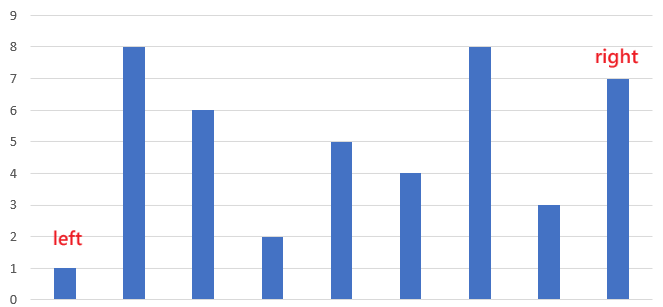

## [11. Container With Most Water](https://leetcode.com/problems/container-with-most-water/description/?envType=study-plan-v2&envId=top-interview-150 "Title")

### 題目
給予一個陣列，紀錄每個位置的高度，求得該容器所能包含的最多水量。


### 解題步驟
1. 設立一個變數left，指向陣列的最左邊。
2. 設立一個變數right，指向陣列的最右邊。
3. 每一輪判斷left和right之間可以盛裝多少水，並且當：  
    + left的高度小於right的時候，left向右移動
    + right的高度小於left的時候，right向左移動

備註：  
這題的解法跟167題非常相像，相當於每一輪都捨棄一個位置，因為該位置不可能再出現更多的容量，例如：height = [1, 8, 6, 2, 5, 4, 8, 3, 7]

  

第一輪的時候，當left指向位置0，right指向位置8，可以看到height[left] < height[right]，因此可以知道left這個位置，不可能再之後的回合中產生更大的面積，相當於下一輪的height從[1, 8, 6, 2, 5, 4, 8, 3, 7] -> [8, 6, 2, 5, 4, 8, 3, 7]


### 程式實作

```javascript
/**
 * @param {number[]} height
 * @return {number}
 */

var maxArea = function(height) {
    let left = 0;
    let right = height.length - 1;
    let max = 0;

    while (left < right) {
        let tempHeight = Math.min(height[left], height[right]);
        let tempArea = tempHeight * (right - left);
        max = max > tempArea ? max : tempArea;

        if (height[left] < height[right]) {
            left++;
        } else {
            right--;
        }
    }

    return max;
};
```

