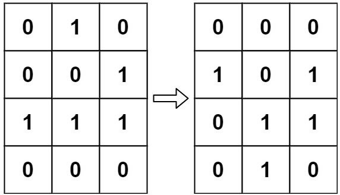

## [289. Game of Life](https://leetcode.com/problems/game-of-life/description/?envType=study-plan-v2&envId=top-interview-150 "Title")

### 題目
給與一個m*n的矩陣，用來記錄每個位置的細胞狀態，1代表該位置的細胞是活的，0代表該位置的細胞是死的，根據下列的規則，每個位置的細胞會在下一次轉變狀態：  
1. 任何少於兩個活鄰居的細胞會死亡。
2. 有兩個或三個活鄰居的活細胞，會繼續生存。
3. 超過三個活鄰居的細胞會死亡。
4. 恰好擁有三個活鄰居的死細胞可以變成活細胞。


Example 1:  

  


### 解題步驟
1. 如果在不增加額外空間的狀況下，就用不同的值紀錄細胞狀態：  

|           | 原本活細胞 | 原本死細胞 |  
| :-:       | :-:       |:-:        |  
| 變成活細胞 | 2         |  0        |
| 變成死細胞 | 1         |  -1       |
2. 走過一次矩陣，根據這輪跟下輪狀態的改變，轉換成對應的值。
3. 將整個矩陣重新轉化成0和1的狀態。
4. 時間複雜度是O(m*n)。


### 程式實作

```javascript
/**
 * @param {number[][]} board
 * @return {void} Do not return anything, modify board in-place instead.
 */
var gameOfLife = function (board) {
    for (let i = 0; i < board.length; i++) {
        for (let j = 0; j < board[0].length; j++) {
            let liveNeighbors = 0;

            for (let secRow = i - 1; secRow <= i + 1; secRow++) {
                if (secRow < 0 || secRow >= board.length) {
                    continue;
                }

                for (let secCol = j - 1; secCol <= j + 1; secCol++) {
                    if (secCol < 0 || secCol >= board[0].length) {
                        continue;
                    }

                    liveNeighbors = board[secRow][secCol] >= 1 ? liveNeighbors + 1 : liveNeighbors;
                }
            }

            liveNeighbors -= board[i][j];

            if (board[i][j] == 0) {
                if (liveNeighbors !== 3) {
                    board[i][j] = -1;
                }
            } else {
                if (liveNeighbors >= 2 && liveNeighbors <= 3) {
                    board[i][j] = 2;
                }
            }
        }
    }

    for (let i = 0; i < board.length; i++) {
        for (let j = 0; j < board[0].length; j++) {
            board[i][j] = board[i][j] === 2 || board[i][j] === 0 ? 1 : 0;
        }
    }
};
```  
