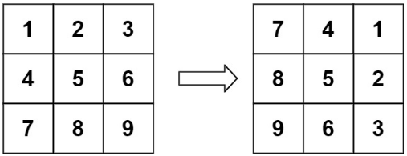

## [48. Rotate Image](https://leetcode.com/problems/rotate-image/description/?envType=study-plan-v2&envId=top-interview-150 "Title")

### 題目
給予一個n*n的二維矩陣，將此矩陣以順時鐘的方式旋轉90度。  
旋轉的時候，用in-place的方式進行，不可以額外配置記憶體空間。

Example 1 :



### 解題步驟 - 方法一
1. 暴力破解法，從外向內，一圈一圈找到對應的位置，並且將其位置的值進行替換。
2. 時間複雜度是O(n<sup>2</sup>)。


### 程式實作

```javascript
/**
 * @param {number[][]} matrix
 * @return {void} Do not return anything, modify matrix in-place instead.
 */
var rotate = function (matrix) {
    let boardSize = matrix.length;
    let round = Math.floor(boardSize / 2);

    for (let i = 0; i < round; i++) {
        let edge = boardSize - i - 1;

        for (let j = i; j < edge; j++) {
            let temp = matrix[i][j];
            matrix[i][j] = matrix[edge - j + i][i];
            matrix[edge - j + i][i] = matrix[edge][edge - j + i]
            matrix[edge][edge - j + i] = matrix[j][edge]
            matrix[j][edge] = temp
        }
    }
};
```

### 解題步驟 - 方法二
1. 這個方法嘗試使用額外的記憶體空間進行解題。
2. 直接將第一行轉成第一列，第二行轉成第二列，以此類推，轉置整個矩陣。

### 程式實作

```javascript
/**
 * @param {number[][]} matrix
 * @return {void} Do not return anything, modify matrix in-place instead.
 */
var rotate = function (matrix) {
    let transMatrix = Array(matrix.length).fill(0);

    transMatrix = transMatrix.map((_, colIndex) => {
        let newRow = matrix.map((eachRow) => {
            return eachRow[colIndex];
        })

        return newRow.reverse();
    })

    for (let i = 0; i < matrix.length; i++) {
        for (let j = 0; j < matrix[0].length; j++) {
            matrix[i][j] = transMatrix[i][j];
        }
    }
};
```