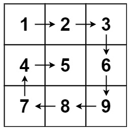
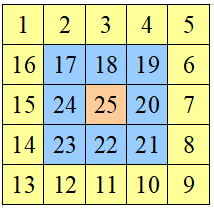
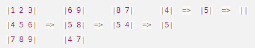

## [54. Spiral Matrix](https://leetcode.com/problems/spiral-matrix/description/?envType=study-plan-v2&envId=top-interview-150 "Title")

### 題目
給予一個m*n的矩陣，回傳矩陣用螺旋讀取的順序。

Example 1:  

  

Input : matrix = [[1, 2, 3], [4, 5, 6], [7, 8, 9]]  
Output : [1, 2, 3, 6, 9, 8, 7, 4, 5]


### 解題步驟 - 方法一
1. 直接模擬螺旋的順序，從最外層開始一層一層向內順時鐘讀取全部元素：  

2. 時間複雜度是O(m*n)。


### 程式實作

```javascript
/**
 * @param {number[][]} matrix
 * @return {number[]}
 */

var spiralOrder = function (matrix) {
    let rowBegin = 0
    let rowEnd = matrix.length - 1
    let colBegin = 0
    let colEnd = matrix[0].length - 1
    let result = []

    while (rowBegin <= rowEnd && colBegin <= colEnd) {
        // 第一列，向右尋找
        for (let j = colBegin; j <= colEnd; j++) {
            result.push(matrix[rowBegin][j])
        }
        rowBegin += 1

        // 最後一行，向下尋找
        for (let i = rowBegin; i <= rowEnd; i++) {
            result.push(matrix[i][colEnd])
        }
        colEnd -= 1

        // 最後一列，向左尋找
        if (rowBegin <= rowEnd) {
            for (let j = colEnd; j >= colBegin; j--) {
                result.push(matrix[rowEnd][j])
            }
        }
        rowEnd -= 1

        // 第一行。向上尋找
        if (colBegin <= colEnd) {
            for (let i = rowEnd; i >= rowBegin; i--) {
                result.push(matrix[i][colBegin])
            }
        }
        colBegin += 1
    }

    return result
};
```
### 解題步驟 - 方法二
1. 參考Leetcode的解法，可以每次先讀取第一列元素，然後逆時針轉置剩餘的矩陣，直到矩陣為空：  



### 程式實作

```javascript
/**
 * @param {number[][]} matrix
 * @return {number[]}
 */

var spiralOrder = function (matrix) {
    let result = [];
    let transMatrix = Array(matrix.length).fill(0).map((_, rowIndex) => {
        return [...matrix[rowIndex]];
    })

    while (transMatrix.length !== 0) {
        result = [...result, ...transMatrix[0]];
        transMatrix = transMatrix.slice(1);

        if (transMatrix.length === 0) {
            break;
        }

        let colLen = transMatrix[0].length - 1;
        transMatrix = transMatrix[0].map((_, colIndex) => transMatrix.map(eachRow => eachRow[colLen - colIndex]));
    }

    return result;
};

```
