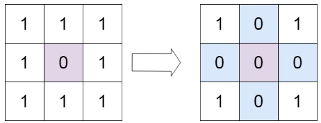
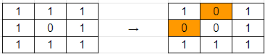

## [73. Set Matrix Zeroes](https://leetcode.com/problems/set-matrix-zeroes/description/?envType=study-plan-v2&envId=top-interview-150 "Title")

### 題目
給予一個m*n的矩陣，如果某個位置為0，則該行和該列全部轉換成0。

Example 1:  

  


### 解題步驟
1. 先紀錄第一列和第一行是否需要轉換成0。
2. 走過矩陣的所有位置，如果該位置為0，則在該位置對應到的第一行和第一列標記為0：  
  
3. 將第一列標記0的行，該行全部轉換成0；將第一行標記0的列，該列全部轉換成0。
4. 再根據先前的紀錄，將第一列或第一行轉換成0。
5. 時間複雜度是O(m*n)。

### 程式實作

```javascript
/**
 * @param {number[][]} matrix
 * @return {void} Do not return anything, modify matrix in-place instead.
 */
var setZeroes = function (matrix) {
    let firstRowZero = false;
    let firstColZero = false;

    for (let i = 0; i < matrix.length; i++) {
        for (let j = 0; j < matrix[0].length; j++) {
            if (matrix[i][j] === 0) {
                if (i === 0) {
                    firstRowZero = true;
                } else if (j === 0) {
                    firstColZero = true;
                } else {
                    matrix[0][j] = 0;
                    matrix[i][0] = 0;
                }
            }
        }
    }

    for (let i = 1; i < matrix.length; i++) {
        for (let j = 1; j < matrix[0].length; j++) {
            if (matrix[i][0] === 0 || matrix[0][j] === 0) {
                matrix[i][j] = 0;
            }
        }
    }

    if (matrix[0][0] === 0) {
        firstRowZero = true;
        firstColZero = true;
    }

    if (firstRowZero) {
        for (let col = 0; col < matrix[0].length; col++) {
            matrix[0][col] = 0;
        }
    }

    if (firstColZero) {
        for (let row = 0; row < matrix.length; row++) {
            matrix[row][0] = 0;
        }
    }
};
```  

<br />
  
這樣的寫法似乎太過冗長，根據Leetcode上的寫法，進行縮減：

```javascript
var setZeroes = function (matrix) {
    let firstColZero = false;

    for (let i = 0; i < matrix.length; i++) {
        firstColZero = matrix[i][0] === 0 ? true : firstColZero;

        for (let j = 1; j < matrix[0].length; j++) {
            if (matrix[i][j] === 0) {
                matrix[i][0] = 0;
                matrix[0][j] = 0;
            }
        }
    }

    for (let i = matrix.length - 1; i >= 0; i--) {
        for (let j = matrix[0].length - 1; j >= 1; j--) {
            if (matrix[i][0] === 0 || matrix[0][j] === 0) {
                matrix[i][j] = 0;
            }
        }
        if (firstColZero) {
            matrix[i][0] = 0;
        }
    }
};
```
