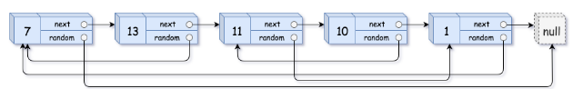

## [138. Copy List with Random Pointer](https://leetcode.com/problems/copy-list-with-random-pointer/description/?envType=study-plan-v2&envId=top-interview-150 "Title")

### 題目
給予一個鏈結串列，每個節點有    

    + val：記錄節點的值  
    + next：指向下一個節點
    + random：指向任一節點



針對這個鏈結串列進行拷貝。


### 解題步驟
1. 遍尋鏈結串列，用相同順序建立一個新的串列，並且用map紀錄對應的新舊節點。
2. 再遍尋一次鏈結串列，藉由map找到原本的random節點會是新鏈結串列的哪一個節點。


### 程式實作
```JS
/**
 * @param {Node} head
 * @return {Node}
 */
var copyRandomList = function(head) {
    let pointer = head
    let nodeMap = new Map()
    let newHead = new Node()
    let node = newHead

    while(pointer) {
        node.next = new Node(pointer.val, null, null)
        node = node.next
        nodeMap.set(pointer, node)
        pointer = pointer.next
    }

    pointer = head
    node = newHead.next

    while(pointer) {
        node.random = nodeMap.get(pointer.random) || null
        node = node.next
        pointer = pointer.next
    }
    
    return newHead.next
};
```

