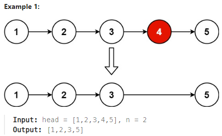

## [19. Remove Nth Node From End of List](https://leetcode.com/problems/remove-nth-node-from-end-of-list/description/?envType=study-plan-v2&envId=top-interview-150 "Title")

### 題目
給予一個鏈結串列，將結尾數來的第n個node從串列中移除。



### 解題步驟
1. 從題目可以知道，要移除的節點會距離結尾n個節點。
2. 建立一個空節點，作為串列的起始節點，並用兩個指標分別指向起始節點，另一個指標指向起始節點後第n個節點，例如n = 2：  
<font color=#008000>dummy(prev) -> 1 -> 2(tail) -> 3 -> 4 -> 5 -> 6 </font>
3. 兩個指標同時移動，直到後面的指標抵達最後一個節點：  
<font color=#008000>dummy -> 1 -> 2 -> 3 -> 4(prev) -> 5 -> 6(tail) </font>
4. 移除pre指標指向的下一個節點：  
<font color=#008000>dummy -> 1 -> 2 -> 3 -> 4(prev) -> 6(tail) </font>

### 程式實作
```JS
/**
 * @param {ListNode} head
 * @param {number} n
 * @return {ListNode}
 */
var removeNthFromEnd = function (head, n) {
    let dummyNode = new ListNode(0, head);
    let pre = dummyNode;
    let tail = head;

    for (let i = 1; i < n; i++) {
        tail = tail.next;
    }

    while (tail.next !== null) {
        tail = tail.next;
        pre = pre.next;
    }

    pre.next = pre.next.next;

    return dummyNode.next;
};

```

