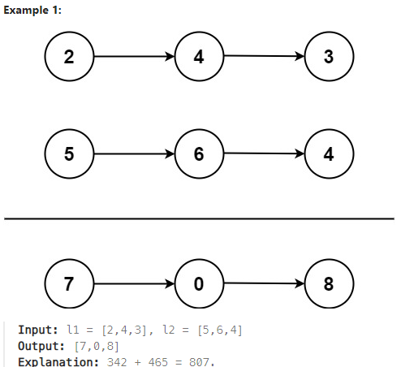

## [2. Add Two Numbers](https://leetcode.com/problems/add-two-numbers/description/?envType=study-plan-v2&envId=top-interview-150https://leetcode.com/problems/add-two-numbers/description/?envType=study-plan-v2&envId=top-interview-150 "Title")

### 題目
給予兩個非空的鏈結串列，每個元素都是正數，以相反的順序儲存。  
將兩個串列的數字相加，並回傳加總後的鏈結串列。



### 解題步驟
1. 兩個指標分別指向l1和l2目前的位置，並建立加總後鏈結串列的起始節點。
2. 將目前l1和l2位置的值加總，並加上上個位置的進位。
3. 判斷目前位置加總後是否產生進位，建立新的節點後，將其值設為加總後的個位數。
5. 將新增的節點放到加總鏈結串列的尾端，l1和l2指向下一個位置
6. 進行新的計算，直到完成所有節點。
7. 回傳加總後的鏈結串列。


### 程式實作

```JS
/**
 * @param {ListNode} l1
 * @param {ListNode} l2
 * @return {ListNode}
 */
var addTwoNumbers = function (l1, l2) {
    let sumList = new ListNode();
    let sumListHead = sumList;
    let carryNum = 0;

    while (l1 || l2 || carryNum > 0) {
        let newNode = new ListNode();
        let l1Val = l1 ? l1.val : 0;
        let l2Val = l2 ? l2.val : 0;
        let temp = l1Val + l2Val + carryNum;

        carryNum = temp >= 10 ? 1 : 0;
        temp -= carryNum * 10;

        newNode.val = temp;
        sumList.next = newNode;
        sumList = sumList.next;

        l1 = l1 && l1.next;
        l2 = l2 && l2.next;
    }

    return sumListHead.next;
};
```

