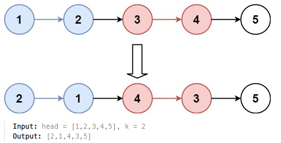

## [25. Reverse Nodes in k-Group](https://leetcode.com/problems/reverse-nodes-in-k-group/description/?envType=study-plan-v2&envId=top-interview-150 "Title")

### 題目
給予一個鏈結串列，每k個節點進行反轉，並回傳反轉後的串列：



### 解題步驟
1. 每k個節點，就將該區間的串列進行反轉，直到鏈結串列結束。
2. 要注意最後幾個節點如果沒辦法湊足k個節點，就不須用進行反轉。
3. 反轉的過程：  
    * 一開始先建立一個dummyNode，並讓prev指向dummyNode，prev指向的位置就是反轉區間開始的前一個節點。並將reverseStart指向反轉區間的第一個節點：  
    <font color=#008000>prev -> 1(reverseStart) -> 2 -> 3 -> 4 -> 5 -> 6 </font>
    * 開始進行反轉，將reverseStart指向的下一個節點，移到反轉區間的第一個位置，因此要先將其指向的下一個位置保存起來：  
    <font color=#008000>prev -> 1(reverseStart) -> 2(準備移動的node) -> 3(temp) -> 4 -> 5 -> 6 </font>
    * 將準備移動的node移到prev的下一個位置，成為反轉區間的起始位置，因為移動，此時變成兩個串列：  
    <font color=#008000>prev -> 2 -> 1(reverseStart)</font>  
    <font color=#008000>3(temp) -> 4 -> 5 -> 6 </font>
    * 將串列連接起來，就完成一個節點的反轉，依照k值，反轉k-1次後，完成該區間的反轉：  
    <font color=#008000>prev -> 2 -> 1(reverseStart) -> 3 -> 4 -> 5 -> 6</font> 


### 程式實作
```JS
/**
 * @param {ListNode} head
 * @param {number} k
 * @return {ListNode}
 */
var reverseKGroup = function (head, k) {
    let dummyNode = new ListNode(null, head);
    let nodeCount = 0;
    for (let ptr = head; ptr !== null; ptr = ptr.next) {
        nodeCount++;
    }

    for (let prev = dummyNode, reverseStart = head; nodeCount >= k; nodeCount -= k) {
        for (let i = 1; i < k; i++) {
            let temp = reverseStart.next.next;
            reverseStart.next.next = prev.next;
            prev.next = reverseStart.next;
            reverseStart.next = temp;
        }

        prev = reverseStart;
        reverseStart = reverseStart.next;
    }

    return dummyNode.next;
};
```

