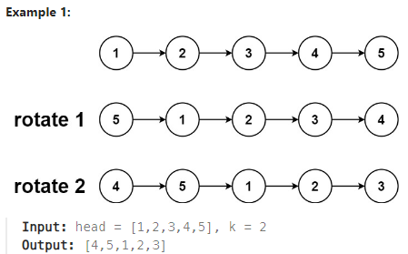

## [61. Rotate List](https://leetcode.com/problems/rotate-list/?envType=study-plan-v2&envId=top-interview-150 "Title")

### 題目
給予一個鏈結串列，並給一個k值，使其向右旋轉k次。



### 解題步驟
1. k可能大於節點的數量，造成重複的循環。
2. 找到距離結尾(k % 節點數)的節點後，其前面的節點指向null，最後一個節點指向起始節點，完成了旋轉。假設旋轉的次數是2：  
  <font color=#008000> 1 -> 2 -> 3 -> 4 (目標節點) -> 5 </font>  
  前一個節點指向null，最後節點指向起始節點，完成旋轉：    
  <font color=#008000>  4 -> 5 -> 1 -> 2 -> 3</font>

### 程式實作
```JS
var rotateRight = function (head, k) {
    let dummyNode = new ListNode(null, head);
    let nodeCount = 0;
    let tail = dummyNode;
    let ptr = head;

    while (ptr) {
        nodeCount++;
        ptr = ptr.next;
        tail = tail.next;
    }

    k = k % nodeCount;
    k = k === 0 ? 0 : nodeCount - k;
    ptr = dummyNode;

    for (let i = 0; i < k; i++) {
        ptr = ptr.next;
    }

    head = ptr.next;
    ptr.next = null;
    tail.next = dummyNode.next;

    return head;
};
```

