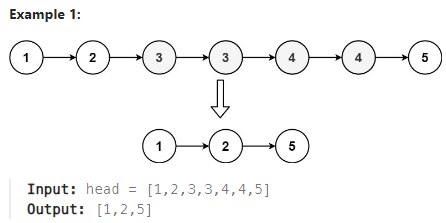

## [82. Remove Duplicates from Sorted List II](https://leetcode.com/problems/remove-duplicates-from-sorted-list-ii/description/?envType=study-plan-v2&envId=top-interview-150 "Title")

### 題目
給予一個已經排序好的鏈結串列，移除掉所有重複的節點。



### 解題步驟
1. 因為已經排序過，檢查每個節點的時候：  
    * 如果節點與後面節點重複，將前面節點的next指向這個重複區間的下一個節點，例如：  
    <font color=#008000> 1 (pre) -> 2 (pre.next) -> 2 -> 4 -> 5 -> 6 </font>  
    因為重複，轉換成：  
    <font color=#008000> 1 (pre) -> 2 -> 2 -> 4 (pre.next) -> 5 -> 6 </font>
    * 如果節點沒有重複，前面節點的next可以指向目前的節點


### 程式實作
```JS
var deleteDuplicates = function (head) {
    let dummyNode = new ListNode(null, head);
    let pre = dummyNode;
    let ptr = head;

    while (ptr) {
        while (ptr.next && ptr.val === ptr.next.val) {
            ptr = ptr.next;
        }

        if (pre.next === ptr) {
            pre = ptr;
        } else {
            pre.next = ptr.next;
        }

        ptr = ptr.next;
    }

    return dummyNode.next
}
```

