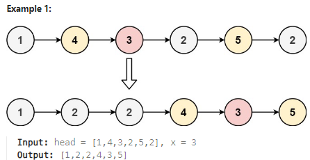

## [86. Partition List](https://leetcode.com/problems/partition-list/description/?envType=study-plan-v2&envId=top-interview-150 "Title")

### 題目
給予一個鏈結串列，並給予一個x值，將鏈結串列分成兩部分，前半部的值都小於x，後半部的值大於等於x，兩部分節點的相對順序要跟原本的順序相同：



### 解題步驟
1. 建立一個鏈結串列，用來暫時存放值大於等於x的節點。
2. 檢查每個節點的下一個節點的值：  
    * 如果該值小於x，代表next指向該節點沒有問題
    * 如果該值大於等於x，next要指向下一個小於x的節點，並將該區間值大於等於x的節點紀錄到另一個串列
3. 檢查完所有節點後，將紀錄大於等於x值節點的串列接回。


### 程式實作
```JS
/**
 * @param {ListNode} head
 * @param {number} x
 * @return {ListNode}
 */
var partition = function (head, x) {
    let dummyNode = new ListNode(null, head);
    let ptr = dummyNode;
    let maxHead = new ListNode(null, null);
    let maxPtr = maxHead;

    while (ptr.next) {
        while (ptr.next && ptr.next.val >= x) {
            maxPtr.next = ptr.next;
            maxPtr = maxPtr.next;
            ptr.next = ptr.next.next;
        }
        ptr = ptr.next ? ptr.next : ptr;
    }

    ptr.next = maxHead.next;
    maxPtr.next = null;

    return dummyNode.next;
};
```

