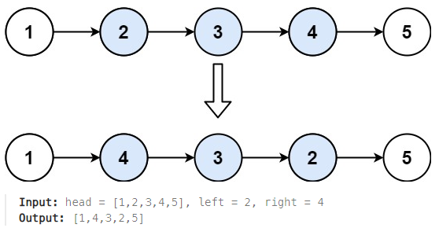

## [92. Reverse Linked List II](https://leetcode.com/problems/reverse-linked-list-ii/description/?envType=study-plan-v2&envId=top-interview-150 "Title")

### 題目
給予一個鏈結串列，根據left和right的位置，翻轉該區間的節點：


### 解題步驟
1. 找到要翻轉的區間，將該區間的節點進行翻轉。
2. 翻轉的方式，可以參考25題。


### 程式實作
```JS
/**
 * @param {ListNode} head
 * @param {number} left
 * @param {number} right
 * @return {ListNode}
 */
var reverseBetween = function (head, left, right) {
    let dummyNode = new ListNode(null, head);
    let prev = dummyNode;
    let reverseStart = head;

    for (let i = 1; i < left; i++) {
        prev = reverseStart;
        reverseStart = reverseStart.next;
    }

    for (let i = left; i < right; i++) {
        let temp = reverseStart.next.next;
        reverseStart.next.next = prev.next;
        prev.next = reverseStart.next;
        reverseStart.next = temp;
    }

    return dummyNode.next;
};
```

