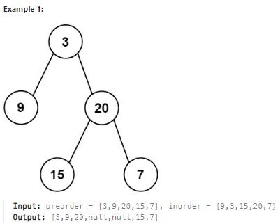

## [105. Construct Binary Tree from Preorder and Inorder Traversal](https://leetcode.com/problems/construct-binary-tree-from-preorder-and-inorder-traversal/description/?envType=study-plan-v2&envId=top-interview-150 "Title")

### 題目
給予兩個陣列，分別代表同一個二元樹的preorder和inorder順序，藉由這兩個陣列，建立這棵二元樹。


### 解題步驟
1. preorder和inorder走過二元數的順序：  
    * preorder：根節點 -> 左子樹 -> 右子樹
    * inorder： 左子樹 -> 根節點 -> 右子樹
2. 因此可以從preorder判斷目前根節點的值，也就是第一個位置，再從inorder判斷哪些值屬於左子樹，哪些屬於右子樹，ex：  
    > preorder = [ 3, 9, 20, 15, 7 ]  
    > inorder = [ 9, 3, 15, 20, 7 ]  
    > 此時根節點就是3，[ 9 ]屬於左子樹，[ 15 , 20 , 7 ]屬於右子樹
3. 左右子樹分別遞迴，完成二元樹。
4. 時間複雜度O(n)。


### 程式實作
```JS
/**
 * @param {number[]} preorder
 * @param {number[]} inorder
 * @return {TreeNode}
 */
var buildTree = function (preorder, inorder) {
    if (preorder.length === 0) {
        return null;
    }

    let node = new TreeNode(preorder[0], null, null);
    let index = inorder.indexOf(preorder[0]);

    node.left = buildTree(preorder.slice(1, 1 + index), inorder.slice(0, index));
    node.right = buildTree(preorder.slice(index + 1), inorder.slice(index + 1));
    return node;
};
```

