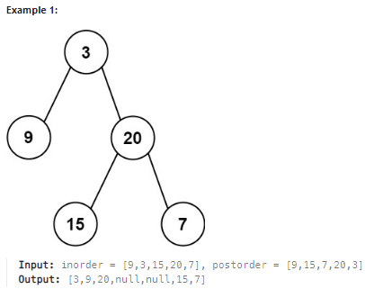

## [106. Construct Binary Tree from Inorder and Postorder Traversal](https://leetcode.com/problems/construct-binary-tree-from-inorder-and-postorder-traversal/description/?envType=study-plan-v2&envId=top-interview-150 "Title")

### 題目
給予兩個陣列，分別代表同一個二元樹的postorder和inorder順序，藉由這兩個陣列，建立這棵二元樹。  


### 解題步驟
1. postorder和inorder走過二元數的順序：  
    * postorder：左子樹 -> 右子樹 -> 根節點
    * inorder： 左子樹 -> 根節點 -> 右子樹
2. 因此可以從postorder判斷目前根節點的值，也就是最後一個位置，再從inorder判斷哪些值屬於左子樹，哪些屬於右子樹，ex：  
    > postorder = [9, 15, 7, 20, 3]  
    > inorder = [ 9, 3, 15, 20, 7 ]  
    > 此時根節點就是3，[ 9 ]屬於左子樹，[ 15 , 20 , 7 ]屬於右子樹
3. 左右子樹分別遞迴，完成二元樹。
4. 時間複雜度O(n)。

### 程式實作
```JS
/**
 * @param {number[]} inorder
 * @param {number[]} postorder
 * @return {TreeNode}
 */
var buildTree = function (inorder, postorder) {
    if (inorder.length === 0) {
        return null;
    }

    let val = postorder[postorder.length - 1];
    let index = inorder.indexOf(val);

    let node = new TreeNode(val, null, null);
    node.left = buildTree(inorder.slice(0, index), postorder.slice(0, index));
    node.right = buildTree(inorder.slice(index + 1), postorder.slice(index, postorder.length - 1))

    return node;
};
```

這裡的postorder因為每次都是取最後一個位置，可以改成用pop，並且要注意順序性，先遞迴右子樹，再遞迴左子樹：

```JS
var buildTree = function (inorder, postorder) {
    if (inorder.length === 0) {
        return null;
    }

    let val = postorder.pop();
    let index = inorder.indexOf(val);

    let node = new TreeNode(val, null, null);
    node.right = buildTree(inorder.slice(index + 1), postorder)
    node.left = buildTree(inorder.slice(0, index), postorder);

    return node;
};
```