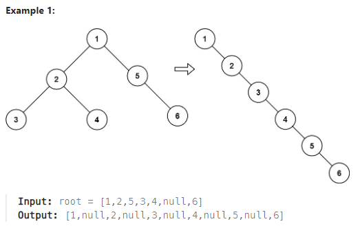

## [114. Flatten Binary Tree to Linked List](https://leetcode.com/problems/flatten-binary-tree-to-linked-list/description/?envType=study-plan-v2&envId=top-interview-150 "Title")

### 題目
給予一個二元樹，以preorder的順序，將樹展平，變成LinkedList：
> * left指向null
> * 只用right指向下一個節點
> * 嘗試用in-place進行修改  




### 解題步驟
1. preorder順序：根節點 -> 左子樹 -> 右子樹
2. 如果節點不存在，或是該節點是葉子節點，代表不需要處理，直接回傳節點。
3. 如果節點存在左子樹：
    > * 先將左子樹展平，變成linked list
    > * 取得左子樹linked list的最後一個節點
    > * 將最後一個節點的right指向右子數的根結點
4. 如果存在右子樹：
    > * 將右子樹展平，變成linked list
    > * 取得右子樹linked list的最後一個節點
5. 回傳這個節點的linked list的最後一個節點。
6. 每個節點走過一次，時間複雜度O(n)。


### 程式實作
```JS
var flatten = function (root) {
    if (!root || (!root.left && !root.right)) return root;

    let lastNode = null;
    let temp = root.right;

    if (root.left) {
        lastNode = flatten(root.left);
        lastNode.right = temp;
        root.right = root.left;
        root.left = null;
    }

    lastNode = temp ? flatten(temp) : lastNode;

    return lastNode;
};
```
