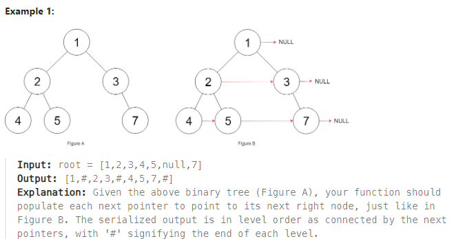

## [117. Populating Next Right Pointers in Each Node II](https://leetcode.com/problems/populating-next-right-pointers-in-each-node-ii/description/?envType=study-plan-v2&envId=top-interview-150 "Title")

### 題目
給予一個二元樹，每個節點的next指向同層的右邊節點


### 解題步驟
1. 以Example 1為例，可以看出next只會指向同一層的節點，這種一層層擴展的方式，讓人聯想到BFS。
2. 以BFS的概念求解：  
> * 第一輪只有一個節點[1]，所以該節點的next指向null，再將左右節點放入陣列[2, 3]  
> * 第二輪的時候，根據上輪的結果，節點2指向節點3，節點3會指向null，並將兩個節點的左右節點放入陣列[4, 5, 7]
3. 以此類推，走完整棵樹之後，時間複雜度是O(n)。


### 程式實作
```JS
/**
 * @param {Node} root
 * @return {Node}
 */
var connect = function (root) {
    if (!root) return root;

    let sameLevelNodes = [root];

    while (sameLevelNodes.length) {
        let temp = [];

        for (let i = 0; i < sameLevelNodes.length; i++) {
            sameLevelNodes[i].next = i < sameLevelNodes.length - 1 ? sameLevelNodes[i + 1] : null;
            sameLevelNodes[i].left && temp.push(sameLevelNodes[i].left);
            sameLevelNodes[i].right && temp.push(sameLevelNodes[i].right);
        }

        sameLevelNodes = temp;
    }

    return root;
};
```
