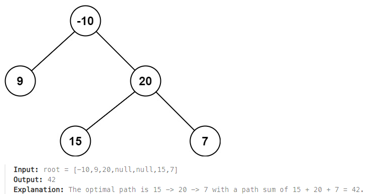

## [124. Binary Tree Maximum Path Sum](https://leetcode.com/problems/binary-tree-maximum-path-sum/?envType=study-plan-v2&envId=top-interview-150 "Title")

### 題目
給予一個二元樹，找出一條路徑：
> * 每個節點最多使用一次
> * 不一定要經過根節點
> * 路徑得到最大的總和



### 解題步驟
1. 每個節點都需要左右子樹的狀況，用postorder的順序進行遞迴。
2. 每個節點分成兩種狀況：
> * 經過節點的路徑，不會再經過上層節點
> * 經過節點的路徑，還會經過上層節點
3. 如果不會再經過上層節點，代表已經形成完整的path，跟其他完整的path比較，是否產生更大的總和。
4. path還未成形，該節點只能選擇其中一邊，或是只有節點自身，並將得到的結果回傳上層節點。


### 程式實作
```JS
/**
 * @param {TreeNode} root
 * @return {number}
 */
var maxPathSum = function (root) {
    let maxSum = root.val;

    function findPath(node) {
        let leftSum = node.left ? findPath(node.left) : 0;
        let rightSum = node.right ? findPath(node.right) : 0;
        let side = null;
        let oneSideMax = null;

        maxSum = Math.max(leftSum + rightSum + node.val, maxSum);

        side = Math.max(leftSum, rightSum);
        oneSideMax = Math.max(side + node.val, node.val);
        return oneSideMax > 0 ? oneSideMax : 0;
    }

    findPath(root)
    return maxSum;
};
```
