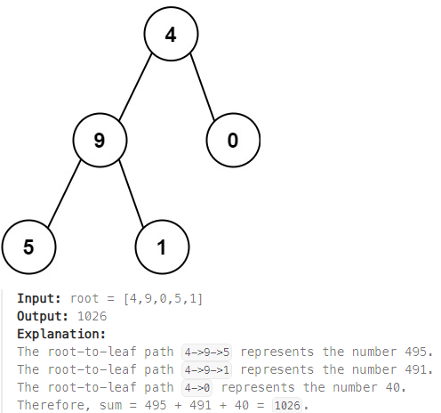

## [129. Sum Root to Leaf Numbers](https://leetcode.com/problems/sum-root-to-leaf-numbers/?envType=study-plan-v2&envId=top-interview-150 "Title")

### 題目
給予一顆二元樹，每個節點的值範圍在0-9，將根節點到葉子節點合成一組數字，並將這些數字加總：



### 解題步驟
1. 從root開始，每向下一層，都是將之前的組合進位，再加上目前節點的值，例如4 -> 9 -> 5，組合的值就是4 -> 49 -> 495
2. 如果是葉子節點，代表產生新的組合，回傳該組合
3. 如果不是葉子節點：
    > *  只存在左節點，將左子樹產生的所有組合相加
    > *  只存在右節點，將右子樹產生的所有組合相加
    > *  同時存在左右節點，將左、右子樹產生的所有組合相加


### 程式實作
```JS
/**
* @param {TreeNode} root
* @return {number}
*/
var sumNumbers = function (root) {
    function calc(node, num) {
        num = num * 10 + node.val;

        let leftSum = node.left ? calc(node.left, num) : 0;
        let rightSum = node.right ? calc(node.right, num) : 0;

        let total = leftSum + rightSum;
        total = total ? total : num;

        return total;
    }

    return calc(root, 0);
};
```
