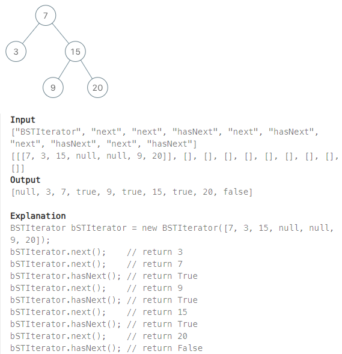

## [173. Binary Search Tree Iterator](https://leetcode.com/problems/binary-search-tree-iterator/?envType=study-plan-v2&envId=top-interview-150 "Title")

### 題目
實作二元搜尋樹的迭代類別：  
 > * BSTIterator(TreeNode root)：進行初始化。
 > * hasNext()：如果還存在下一個最小值，回傳true，否則false。
 > * next()：回傳下一個最小值。
 > * next()跟hasNext()的時間複雜度分別是O(1)，並且空間複雜度是O(h)。



### 解題步驟
1. BST值的大小：左子樹 < 根節點 < 右子樹，所以next的順序會是走完所有左子樹的節點，再到根節點，最後是右子樹。
2. BSTIterator()初始化的時候，從根節點循著left的所有節點記錄在一個stack。
3. 呼叫hasNext()的時候，檢查stack的長度，如果stack為0，代表沒有下一個節點。
4. 呼叫next()的時候，對stack進行pop，這代表該節點以及該節點的左子樹都已經被next呼叫過，此時要將該節點的右側節點放入stack，並且跟初始化一樣，以右側節點為根，沿著左側節點向下，push到stack。


### 程式實作
```JS
/**
 * @param {TreeNode} root
 */
var BSTIterator = function(root) {
    this.stack = []
    while(root) {
        this.stack.push(root)
        root = root.left
    }
};

/**
 * @return {number}
 */
BSTIterator.prototype.hasNext = function() {
    return this.stack.length > 0
};

/**
 * @return {boolean}
 */
BSTIterator.prototype.next = function() {
    let node = this.stack.pop()
    let x = node.right
    while(x) {
        this.stack.push(x)
        x = x.left
    }
    return node.val
};
```
