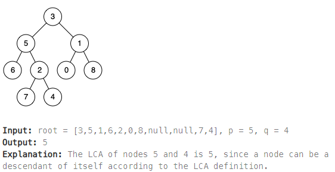

## [236. Lowest Common Ancestor of a Binary Tree](https://leetcode.com/problems/lowest-common-ancestor-of-a-binary-tree/description/?envType=study-plan-v2&envId=top-interview-150 "Title")

### 題目
給予一個二元樹以及兩個節點，尋找兩個節點最近的共同祖先：
1. 兩個節點都在樹中
2. 共同祖先可以是自己



### 解題步驟
1. 遞迴尋找目標節點，根據左子樹、右子樹以及目前節點的結果判斷，回傳：
    * 如果目前節點就是目標節點，回傳自己
    * 如果左右子樹同時回傳節點，代表目前節點是共同祖先，回傳自己
    * 如果左右子樹只有其中一方有節點，且目前節點不是目標節點，回傳左右子樹唯一的節點
2. 時間複雜度O(n)。


### 程式實作
```JS
/**
 * @param {TreeNode} root
 * @param {TreeNode} p
 * @param {TreeNode} q
 * @return {TreeNode}
 */
var lowestCommonAncestor = function (root, p, q) {
    let ancestorCount = 0;

    function findAncestor(node) {
        if (ancestorCount === 2 || !node) {
            return;
        }

        let isNode = node === p || node === q;
        isNode && ancestorCount++;

        let left = findAncestor(node.left);
        let right = findAncestor(node.right);

        let resNode = left || right;
        resNode = (left && right) ? node : resNode;
        resNode = isNode ? node : resNode;

        return resNode;
    }

    return findAncestor(root);
};
```
