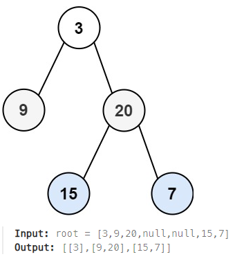

## [102. Binary Tree Level Order Traversal](https://leetcode.com/problems/binary-tree-level-order-traversal/description/?envType=study-plan-v2&envId=top-interview-150 "Title")

### 題目
給予一個二元樹，用Level Order的順序，遍歷所有節點：  



### 解題步驟
1. 從root開始，將同一層的節點放入一個陣列中。
2. 檢查陣列每一個節點的左右節點，如果存在，放入下一層的陣列中。
3. 一層層向下檢查，遍尋每一層的每個節點。
5. 時間複雜度O(n)。

### 程式實作
```JS
/**
 * @param {TreeNode} root
 * @return {number[][]}
 */
var levelOrder = function (root) {
    let res = [];
    let levelNode = root ? [root] : [];

    while (levelNode.length) {
        let temp = [];
        let values = [];

        for (let i = 0; i < levelNode.length; i++) {
            values.push(levelNode[i].val);
            levelNode[i].left && temp.push(levelNode[i].left);
            levelNode[i].right && temp.push(levelNode[i].right);
        }

        res.push(values);
        levelNode = temp;
    }

    return res;
};
```
