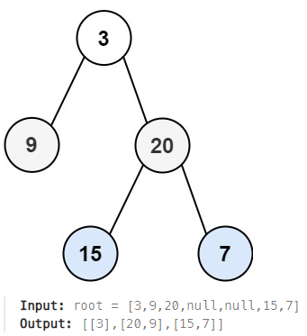

## [103. Binary Tree Zigzag Level Order Traversal](https://leetcode.com/problems/binary-tree-zigzag-level-order-traversal/description/?envType=study-plan-v2&envId=top-interview-150 "Title")

### 題目
給予一個二元樹，使用zigzag的方式，一層層遍歷所有節點：



### 解題步驟
1. 從root開始，將同一層的節點放入一個陣列中。
2. 建立變數reverse，辨識每層節點的值是否要從右到左放入。
3. 檢查陣列每一個節點的左右節點，如果存在，放入下一層的陣列中。
4. 一層層向下檢查，以zigzag的方式遍尋每一層的每個節點。
5. 時間複雜度O(n)。


### 程式實作
```JS
/**
 * @param {TreeNode} root
 * @return {number[][]}
 */
var zigzagLevelOrder = function (root) {
    let levelNode = root ? [root] : [];
    let reverse = false;
    const res = [];

    while (levelNode.length) {
        let values = Array(levelNode.length);
        let temp = [];

        for (let i = 0; i < levelNode.length; i++) {
            let pos = reverse ? levelNode.length - 1 - i : i;
            values[pos] = levelNode[i].val;

            levelNode[i].left && temp.push(levelNode[i].left);
            levelNode[i].right && temp.push(levelNode[i].right);
        }
        res.push(values);
        levelNode = temp;
        reverse = !reverse;
    }

    return res;
};
```
