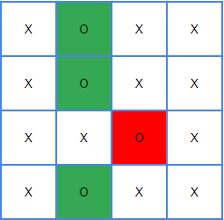

## [130. Surrounded Regions](https://leetcode.com/problems/surrounded-regions/?envType=study-plan-v2&envId=top-interview-150 "Title")

### 題目

給予一個m*n的矩陣，包含"O"和"X"的值：  
* 只有水平和垂直方向可以視為相連  
* 相連的"O"形成一個區域
* 如果該區域被"X"環繞，沒有任何位置連接邊界，代表該區域surrounded


### 解題步驟
1. 從範例可以看出，如果不想被"X"包圍，"O"形成的區塊，至少有一個位置要在邊界：  
      
    > * 綠色區塊相連邊界，可以保留
    > * 紅色區塊沒有通往邊界，會被"X"包圍
    > *  因此只要從四條邊找尋"O"即可
2. 從四條邊找尋"O"，再從該位置使用DFS找到相連的"O"區塊。
3. 為了標記出已經找尋過的位置，如果該位置是可以保留下來的"O"，先轉換成"S"。
4. 搜尋完整個盤面後，所有的"S"轉回"O"，其餘的都是"X"。
5. 時間複雜度O(m*n)。


### 程式實作
```JS
/**
 * @param {character[][]} board
 * @return {void} Do not return anything, modify board in-place instead.
 */
var solve = function (board) {
    const checkPos = [[-1, 0], [1, 0], [0, -1], [0, 1]];
    const boardRow = board.length;
    const boardCol = board[0].length;

    const dfsCheck = (i, j) => {
        if (i < 0 || i >= boardRow || j < 0 || j >= boardCol || board[i][j] === "S" || board[i][j] === "X") {
            return;
        }

        board[i][j] = "S";

        checkPos.forEach(([x, y]) => dfsCheck(i + x, j + y));
    }

    for (let col = 0; col < boardCol; col++) {
        board[0][col] === "O" && dfsCheck(0, col);
        board[boardRow - 1][col] === "O" && dfsCheck(boardRow - 1, col);
    }

    for (let row = 0; row < boardRow; row++) {
        board[row][0] === "O" && dfsCheck(row, 0);
        board[row][boardCol - 1] === "O" && dfsCheck(row, boardCol - 1);
    }

    for (let row = 0; row < boardRow; row++) {
        for (let col = 0; col < boardCol; col++) {
            board[row][col] = board[row][col] === "S" ? "O" : "X";
        }
    }
};
```
