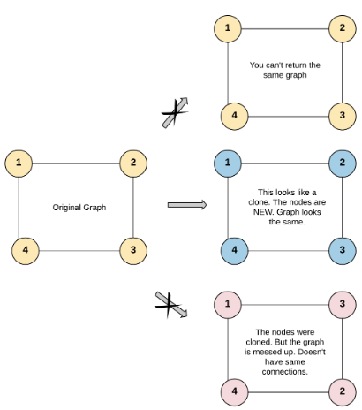

## [133. Clone Graph](https://leetcode.com/problems/clone-graph/description/?envType=study-plan-v2&envId=top-interview-150 "Title")

### 題目
給予一個無向圖，每個節點包含一個值，以及用來記錄鄰居的陣列：
```
class Node {
    public int val;
    public List<Node> neighbors;
}
```
對這張圖進行複製，並且回傳複製圖的其中一個節點：  



以這張圖為例，節點2看起來會類似這樣：  
```
{
    val: 2,
    neighbors: [1, 3]
}
```

### 解題步驟
1. 建立一個map，用來記錄新舊節點的對照。因為每個node的值都是唯一，可以將值作為key，對照到新節點：  
    ```
    { 節點的值 : 新建立的node }
    ```
2. 將題目給的節點放入一個queue和map中。
3. 從queue前端取出一個node：
    * 檢查node的鄰居，如果紀錄的map不存在該鄰居，代表還未巡視過，將鄰居新增到map，並放入queue中
    * 從map找到所有鄰居對應的新節點，更新新節點的neighbors
4. 直到queue變成空陣列，複製完所有新節點。
5. 每個節點經過一次，並檢查其edge，時間複雜度O(V+E)。

### 程式實作
```JS
/**
 * // Definition for a _Node.
 * function _Node(val, neighbors) {
 *    this.val = val === undefined ? 0 : val;
 *    this.neighbors = neighbors === undefined ? [] : neighbors;
 * };
 */

/**
 * @param {_Node} node
 * @return {_Node}
 */
var cloneGraph = function (node) {
    if (!node) {
        return node;
    }

    const queue = [node];
    const record = new Map();
    record.set(node.val, new Node(node.val));

    while (queue.length !== 0) {
        let curNode = queue.shift();
        let newNode = record.get(curNode.val);

        for (let neighbor of curNode.neighbors) {
            if (!record.has(neighbor.val)) {
                record.set(neighbor.val, new Node(neighbor.val));
                queue.push(neighbor);
            }
            newNode.neighbors.push(record.get(neighbor.val));
        }
    }

    return record.get(node.val);
};
```
