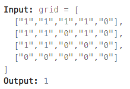
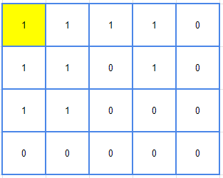
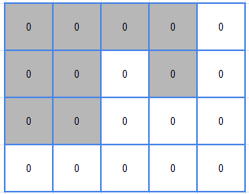

## [200. Number of Islands](https://leetcode.com/problems/number-of-islands/description/?envType=study-plan-v2&envId=top-interview-150 "Title")

### 題目
給予一個m*n的二維網格，"1"代表陸地，"0"代表水，計算有多少塊陸地：



### 解題步驟
1. 從[0, 0]的位置出發，找尋第一塊陸地。
2. 找到第一塊陸地後，使用DFS找到同塊陸地的所有位置，並將找到陸地的位置轉成"0"，避免重複尋找：  
    | 找到位置 | DFS清理 | 
    | :-: | :-: | 
    |  |  | 
3. 以這個方式巡視整個二維矩陣，找出所有陸地數量。
4. 時間複雜度O(m*n)


### 程式實作
```JS
/**
 * @param {character[][]} grid
 * @return {number}
 */
var numIslands = function (grid) {
    const checkPos = [[1, 0], [0, 1], [-1, 0], [0, -1]];
    const row = grid.length;
    const col = grid[0].length;
    let res = 0;

    const clearIsland = (i, j) => {
        if (i < 0 || i >= row || j < 0 || j >= col || grid[i][j] === "0") {
            return;
        }

        grid[i][j] = "0";
        checkPos.forEach(([x, y]) => clearIsland(i + x, j + y));
    }

    for (let i = 0; i < row; i++) {
        for (let j = 0; j < col; j++) {
            if (grid[i][j] === "1") {
                res++;
                clearIsland(i, j);
            }
        }
    }
    return res;
};
```
