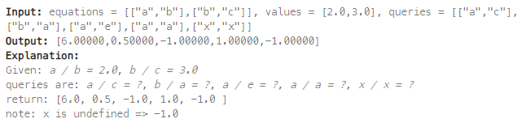
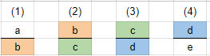

## [399. Evaluate Division](https://leetcode.com/problems/evaluate-division/?envType=study-plan-v2&envId=top-interview-150 "Title")

### 題目
給予兩個陣列，其中一個陣列是一對值，代表除數與被除數的關係，另一個陣列則記錄相除的結果：
```
Input: equations = [["a","b"],["b","c"]], values = [2.0,3.0]
```

再給予一個陣列，也是一對值，藉由上面的input，計算這對值相除的結果：  



### 解題步驟
1. 先用一個map紀錄相除的結果，要注意倒數也可以放進map進行計算(因為題目限制所有value>0，直接放入即可)：
    ```
    範例：
    Input: equations = [["a","b"],["b","c"]], values = [2.0,3.0]
    ```
    ```JS
    map = {
        "a": [[b, 2]],
        "b": [[a, 1 / 2], [c, 3]],
        "c": [[b, 1 / 3]]
    }
    ```
2. 假設要找"a/e"的值，其搜尋到的路徑是：  
      

    可以看到這輪的除數，會做為下一輪的被除數進入搜尋，也就是說會在下一輪用map找尋該除數是否存在，並且繼續往下搜尋。

3. 遞迴的中止條件：
    * 這個數已經走過，回傳-1
    * 進來的除數與被除數相等，代表找到了相除的結果，回傳計算的值

4. 最糟的情況是每組相除結果都被造訪過，所以時間複雜度O(n)。


### 程式實作
```JS
var calcEquation = function (equations, values, queries) {
    let equationsMap = {}
    let visited = new Set();

    for (let i = 0; i < equations.length; i++) {
        equationsMap[equations[i][0]] = equations[i][0] in equationsMap ? equationsMap[equations[i][0]] : [];
        equationsMap[equations[i][1]] = equations[i][1] in equationsMap ? equationsMap[equations[i][1]] : [];
        equationsMap[equations[i][0]].push([equations[i][1], values[i]])
        equationsMap[equations[i][1]].push([equations[i][0], 1 / values[i]])
    }

    function dfs(current, target, sum) {
        if (current === target) return sum;
        if (visited.has(current)) return -1;
        visited.add(current);

        if (current in equationsMap) {
            for (let temp of equationsMap[current]) {
                let res = dfs(temp[0], target, sum * temp[1]);
                if (res !== -1) {
                    return res;
                }
            }
        }

        return -1;
    }

    return queries.map((query) => {
        if (!(query[0] in equationsMap) || !(query[1] in equationsMap)) {
            return -1;
        }

        if (query[0] === query[1]) {
            return 1;
        }

        visited.clear();
        return dfs(query[0], query[1], 1);
    });
};
```
